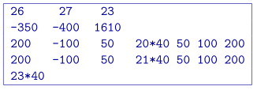

.. _meshfile:

Mesh file
=========

The mesh defines the model region. The two choices for the mesh is to (1) only have a single vertical layer or (2) to have the same cell thickness throughout the mesh. If the latter is chosen and topography is given, :ref:`magsenes` will choose the layer based on topography. The mesh file has the following structure:

.. figure:: ../../images/mesh3D.png
    :align: center
    :figwidth: 50%

- :math:`NE`: Number of cells in the East direction.

- :math:`NN`: Number of cells in the North direction

- :math:`NZ`: Number of cells in the vertical direction

-  :math:`E_o, N_o, Z_o`: Coordinates, in meters, of the southwest top corner, specified in (Easting, Northing, Elevation). The elevation can be relative to a reference elevation other than the sea level, but it needs to be consistent with the elevation used to specify the locations, observations, and topography files.

- :math:`\Delta E_n`: :math:`n^{th}` cell width in the easting direction (ordered W to E).

- :math:`\Delta N_n`: :math:`n^{th}` cell width in the northing direction (ordered S to N).

- :math:`\Delta Z_n`: :math:`n^{th}` cell thickness. **These must be all the same or NZ=1**.

The mesh can be designed in accordance with the area of interest and the spacing of the data available in the area. In general, the mesh consists of a core region which is directly beneath the area of available data, and a padding zone surrounding this core mesh. Padding is allowed with the equivalent source, but only horizontally. Within the core mesh, the size of the cells should be at least half the spacing of the data. There is no restriction on the relative position of data location and nodal points in horizontal direction. The cell width in this area is usually uniform. Beyond the core region, the mesh should be padded with cells that increase (typically no more than 40% of the previous length). 

The vertical position of the mesh is specified in elevation. This is to accommodate the inversion of a data set acquired over a topographic surface. When there is strong topographic relief, which the user wishes to incorporate it into the inversion, a 2D layer will be built internally. Otherwise, the top of the mesh will be chosen as its layer. Only calculated sensitivities are stored. 

Example
-------

This example shows a mesh that consists of 26 cells in easting, 27 cells in the northing, and 23 cells in the vertical directions. The top of the mesh is located at 1610 m of elevation and the southwest corner is at -350 m easting and -400 m northing. The cells in the core portion of the mesh are all 40 m :math:`\times` 40 m :math:`\times` 25 m. There are three cells in the padding zone in every direction except vertically. This mesh is valid because each cell has a vertical cell width of 25 m. 

