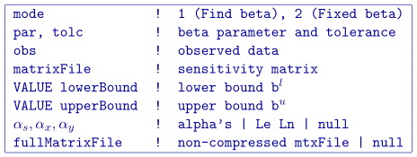
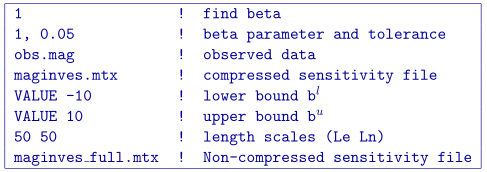

.. _maginves:

MAGINVES
========

This program actually performs the equivalent source re-construction through the inversion of magnetic data. Command line usage is:

``maginves maginves.inp [nThreads]``

For a sample input file type:

``maginves -inp``

The argument specifying the number of CPU threads used in the OpenMP format is optional. If this argument is not given to the program, chooses to use all of the CPU threads on the machine. This argument allows the user to specify half, for example, of the threads so that the program does not take all available RAM. Note that this option is not available in the MPI-based code used for clusters.

Input files
-----------

Input files can be any file name. If there are spaces in the path or file name, you *MUST* use quotes around the entire path (including the filename). Files that may be used by the inversion are:

#. ``obs``: Mandatory :ref:`observations file <magfile>`.

#. ``maginves.mtx``: Mandatory sensitivity matrix from :ref:`magsenes`

#. ``maginves.inp``: The control file containing the options. Does not need to be specifically called "maginves.inp".

   
The input file should be formatted as follows:

The parameters within the control file are:

-  ``mode``: An integer specifying one of three choices for determining the trade-off parameter.

   #. ``mode=1``: the program chooses the trade off parameter by carrying out a line search so that the target value of data misfit is achieved (e.g., :math:`\phi_d^*=N`).

   #. ``mode=2``: the user inputs the trade off parameter.

- ``par``, ``tolc`` Two real numbers that are dependent upon the value of mode.
   
   #. ``mode=1``: the target misfit value is given by the product of ``par`` and the number of data :math:`N` , i.e., ``par=1`` is equivalent to :math:`\phi_d^*=N` and ``par=0.5`` is equivalent to :math:`\phi_d^*=N/2` . The second parameter, ``tolc``, is the misfit tolerance in fractional percentage. The target misfit is considered to be achieved when the relative difference between the true and target misfits is less than ``tolc``. Normally, ``par=1`` is ideal if the true standard deviation of error is assigned to each datum. When ``tolc=0``, the program assumes a default value of ``tolc=0.02`` since this number must be positive.

   #. ``mode=2``: ``par`` is the user-input value of trade off parameter. In this case, ``tolc`` is not used by the program.

   | **NOTE:** When both ``par`` and ``tolc`` are used. When only ``par`` is used. When ``mode=3``, neither nor ``tolc`` are used. However, the third line should always have two values.

-  ``obs``: Input :ref:`data file <magfile>`. The file must specify the standard deviations of the error. By definition these values are greater than zero.

-  ``matrixFile``: The binary file of sensitivities created by :ref:`magsenes`.

-  ``VALUE lowerBound``: The lower bounds model is defined globally as a value (e.g., ``VALUE -1``).

-  ``VALUE upperBound``: The upper bounds model is defined globally as a value (e.g., ``VALUE 1``).

- :math:`\alpha_s, \alpha_x, \alpha_y`: Coefficients for the each model component. :math:`\alpha_s` is the smallest model component. Coefficient for the derivative in the easting direction. :math:`\alpha_y` is the coefficient for the derivative in the northing direction.

   If ``null`` is entered on this line, then the above four parameters take the following default values:  :math:`\alpha_s = 0.0001, \alpha_x = \alpha_y = 1`. All alphas must be positive and they cannot be all equal to zero at the same time. There is no vertical length scale because the model is a single layer of cells.

   **NOTE:** The three coefficients may be substituted for three corresponding *length scales* :math:`L_x` and :math:`L_y` and are in units of metres. To understand the meaning of the length scales, consider the ratios :math:`\alpha_x/\alpha_s` and :math:`\alpha_y/\alpha_s`. They generally define smoothness of the recovered model in each direction. Larger ratios result in smoother models, smaller ratios result in blockier models. The conversion from :math:`\alpha`\'s to length scales can be done by:

   .. math::

      \label{eq:lengths}
      L_x = \sqrt{\frac{\alpha_x}{\alpha_s}} ; ~L_y = \sqrt{\frac{\alpha_y}{\alpha_s}}

   When user-defined, it is preferable to have length scales exceed the corresponding cell dimensions. Typically having length scales of four cell widths are a good starting point.

-  ``fullMatrixFile``: The binary file of full sensitivities created by :ref:`magsenes` (i.e., no wavelet compression). If this file is given, the program will go to 90% of the desired misfit with the compressed sensitivity matrix (line 4) and then finish the inversion with this matrix. An error will occur if the wavelet transform is applied to this matrix. This matrix could be used above and then this input in unnecessary. ``null`` will have the program solve to the desired misfit using the first matrix file.

Example of control file
~~~~~~~~~~~~~~~~~~~~~~~

Below is an example of a control file:

Output files
------------

Four general output files are created by the inversion. They are:

#. ``maginves.log``: The log file containing the minimum information for each iteration and summary of the inversion.

#. ``maginves.out``: The "developers" log file containing the details of each iteration including the model objective function values for each component, number of conjugate gradient iterations, etc.

#. ``maginves_xxx.sus``: Susceptibility :ref:`model files <modelFile>` output after each "xxx" iteration (i.e., ``maginves_012.sus``). Model cells not used in maginves will be given the value of -100.

#. ``maginves_xxx.pre``: :ref:`Predicted data files <magfile>` (without uncertainties) output after each "xxx" iteration.

