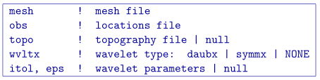
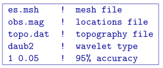

.. _magsenes:

MAGSENES
========

This program performs the sensitivity calculation. Command line usage:

``magsenes magsenes.inp [nThreads]``

For a sample input file type:

``magsenes -inp``

The argument specifying the number of CPU threads used in the OpenMP format is optional. If this argument is not given to the program, chooses to use all of the CPU threads on the machine. This argument allows the user to specify half, for example, of the threads so that the program does not take all available RAM. Note that this option is not available in the MPI-based code used for clusters.

Input files
-----------

Format of the control file:

The input parameters for the control file are:

- ``mesh``: Name of modified 3D :ref:`mesh file <meshFile>`.

- ``obs``: The :ref:`data file <magFile>` that contains the observation locations. Note for sensitivity calculations, standard deviations are not required, but this file may be the observations that will be used in the inversion (with uncertainties).

- ``topo``: Surface :ref:`topography <topoFile>`. If ``null`` is entered, the surface will be treated as being flat on top of the mesh.

- ``wvltx``: A five-character string identifying the type of wavelet used to compress the sensitivity matrix. The types of wavelets available are Daubechies wavelet with 1 to 6 vanishing moments (``daub1``, ``daub2`` and so on) and Symmlets with 4 to 6 vanishing moments (``symm4``, ``symm5``, ``symm6``). Note that ``daub1`` is the Haar wavelet and ``daub2`` is the Daubechies-4 wavelet. The Daubechies-4 wavelet is suitable for most inversions, while the others are provided for user's experimentation. If ``NONE`` is entered, the program does not use wavelet compression.

- ``itol``, ``eps``: An integer and real number that specify how the wavelet threshold level is to be determined. This line is ignored if no wavelet compression is being used, however the line *must still* be in the input file.
    | ``itol=1``: program calculates the relative threshold and ``eps`` is the relative reconstruction error of the sensitivity. A reconstruction error of 0.05 (95%) is usually adequate.
    | ``itol=2``: the user defines the threshold level and ``eps`` is the threshold to be used. If ``null`` is entered on this line, a default relative reconstruction error of 0.05 (e.g. 5%) is used and the relative threshold level is calculated (i.e., ``itol=1`` , ``eps=0.05``).
    | **NOTE** The detailed explanation of threshold level and reconstruction error can be found in the :ref:`wavelet section <waveletSection>` of this manual.

Example of input file
~~~~~~~~~~~~~~~~~~~~~

Below is an example of an input file using wavelets.

Output files
------------

The program ``magsenes`` outputs three files. They are:

#. ``magsenes.log``: Log file with input file, wavelet parameters, and CPU time.

#. ``maginves.mtx``: The sensitivity matrix file to be used in the inversion. This file contains the sensitivity matrix, mesh, and discretized surface topography. It is produced by the program and it's name is not adjustable. It can get quite large and may be deleted once the work is completed.

#. ``maginves_full.mtx``: The full sensitivity matrix file (no wavelet compression) to be used in the inversion. This file contains the sensitivity matrix, mesh, and discretized surface topography. It is produced by the program and it's name is not adjustable. It can get quite large and may be deleted once the work is completed. It can be used on its own or in conjunction with the previous matrix file. This will allow the inversion to solve quickly in the wavelet domain and then accurately with the non-compressed sensitivity.

